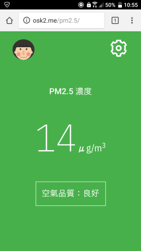
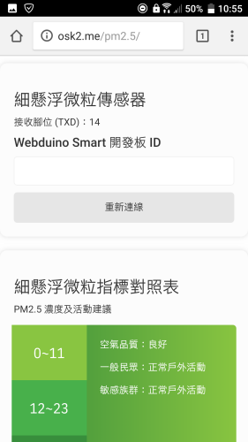

# PM2.5 Monitor

This project is forked and refactor from [birteliu/pm2.5](https://github.com/birteliu/pm2.5)

Major differences are shown as below

- Rewrite with Vue
- Ability to connect automatically after first time setup
- Adjust UI to fit both PC and mobile device
- Significant improvement of readability and maintianability

# Preview

# Prerequisite

- Webduino Smart
- G3 sensor (TXD on pin 14)

# Demo

[https://osk2.me/pm2.5](https://osk2.me/pm2.5)

# License

This project is released under the MIT License, read [LICENSE](LICENSE) for more detail.